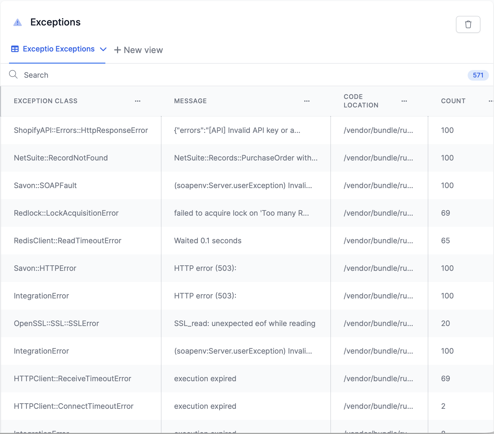
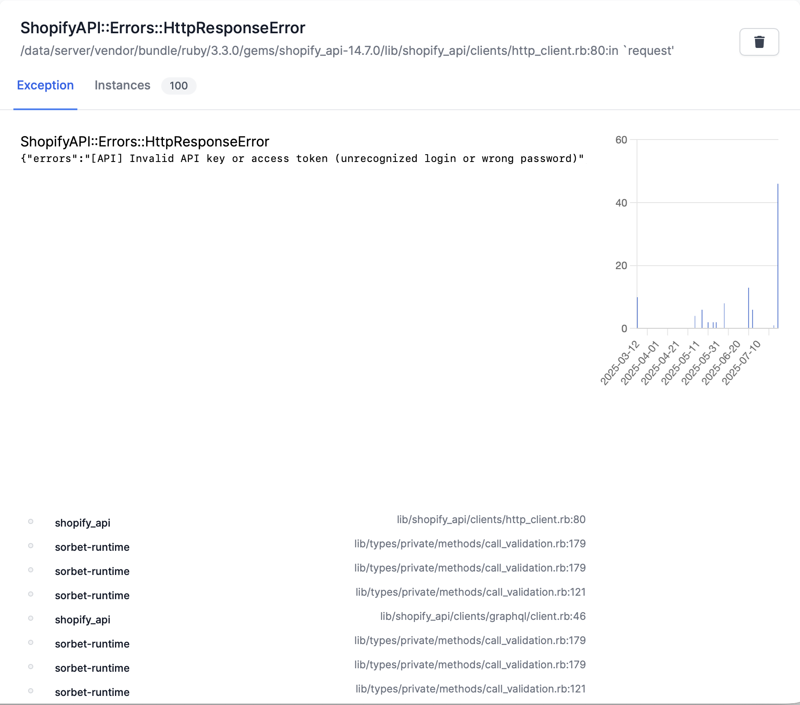

# Exceptio

Exception logging and management

## What it looks like

The list view shows you all the exceptions we caught.



We have a detail view, which shows you the exception that happens and the instances it happened, up to 100.
It also shows you a graph of when these instances happened.



## Installation and Usage

Add this line to your application's Gemfile:

```ruby
gem 'exceptio'
```

Add to ApplicationController

`rescue_from StandardError, with: :error_render_method`

```ruby
def error_render_method(exception)
  raise exception if Rails.env.development?

  Exceptio::ExceptionRecordingService.new(exception, request_env: request.env).call

  respond_to do |type|
    type.html do
      begin
        render template: "/exceptio/exception", layout: false, status: 500
      rescue
        render template: "/exceptio/exception", layout: false, status: 500
      end
      false
    end
    type.js { render json: { error: 'internal server error' }, status: 500 } 
    type.all { render nothing: true, status: 500 }
  end
end
```

Next add to the route.rb:

```ruby
mount Exceptio::Engine => "/exceptions"
```

Run the Rails tasks to install and run the migrations:

```
bin/rails exceptio:install:migrations 
bin/rails db:migrate
```


## License

The gem is available as open source under the terms of the [MIT License](https://opensource.org/licenses/MIT).
